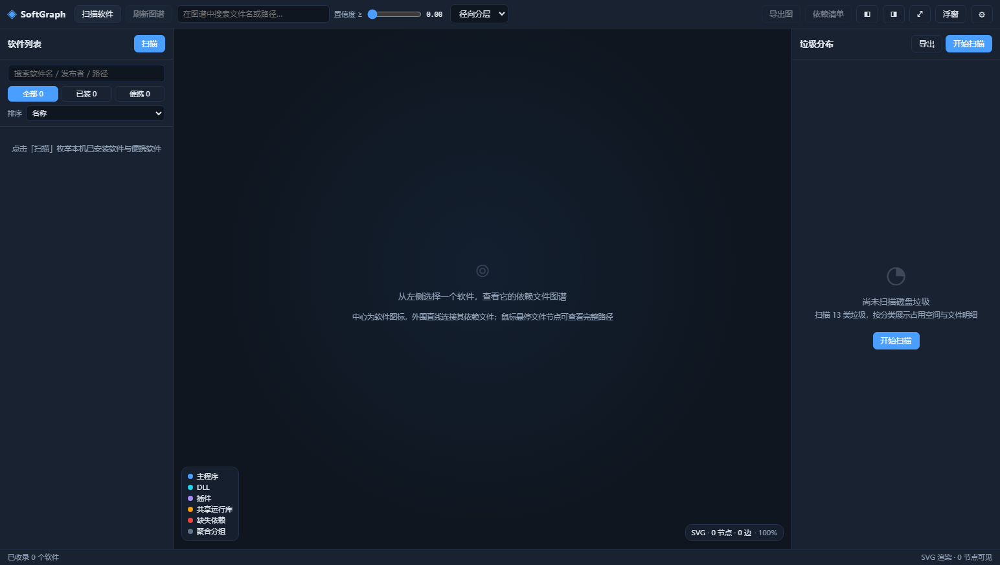

# SoftGraph — 软件图谱与磁盘清理工具

一款 Windows 桌面应用：把「装了什么 / 依赖谁 / 垃圾在哪」三件事合并成一张图。

- **模块一 · 软件图谱**：以软件图标为中心，直线连接外围依赖文件，鼠标悬停即显示完整路径与全部属性；侧边栏同步呈现磁盘垃圾分布，支持按分类删除与一键清空。
- **模块二 · 桌面浮窗**：常驻桌面的透明浮窗，内容由插件自由组合，支持靠边自动隐藏、鼠标移入滑出。

依据《SoftGraph 软件图谱与磁盘清理工具 技术设计方案 V1.0》实现，技术路线为
**Electron 33 + Vue 3 + TypeScript + Vite + d3-force + SQLite**。

---

## 快速开始

### 直接运行（推荐）

到 Releases 下载，或用仓库根目录构建：

```bash
npm install                 # 已内置 npmmirror 镜像配置（.npmrc）
npm run dev                 # 开发模式（热重载）
npm run build               # 构建到 out/
npm run pack:win            # 产出 release/1.0.0/ 下的安装包 + 便携版
```

打包产物：

| 文件 | 说明 |
|---|---|
| `SoftGraph Setup 1.0.0.exe` | NSIS 安装包（约 86 MB），可选安装目录、创建快捷方式 |
| `SoftGraph-1.0.0-portable.exe` | 免安装便携版（约 86 MB），双击即用 |

> 未做代码签名，杀软可能误报（扫描类工具常见，对应设计文档风险 R8），加入白名单即可。

### 首次使用

1. 点顶栏「扫描软件」→ 等待约 20~30 秒（本机实测收录 318 个软件，含 47 个便携软件）
2. 左侧点选任一软件 → 中间自动构建依赖图谱
3. 鼠标移到任意文件节点 → 显示完整路径等七项详情
4. 右侧点「开始扫描」→ 查看 13 类垃圾分布，勾选后「分类删除」或「一键删除」

---

## 功能一览

### 模块一：软件图谱工具

| 能力 | 说明 |
|---|---|
| 软件发现 | 注册表卸载项（HKLM/HKCU + WOW6432Node）、MSI 产品、App Paths、Microsoft Store、服务宿主 |
| 便携软件识别 | 七特征加权：目录自包含 +30 / 无卸载项 +20 / 本地配置 +15 / 目录可写 +10 / 无安装器痕迹 +10 / 版本资源 +10 / 手动标记 +100 |
| 依赖解析 | 纯 TS PE 解析器：导入表、延迟导入表、.NET 程序集引用、SxS 清单、版本资源 |
| 证据融合 | 八类证据（E1–E7 已实现，E8 预留）加权出 0~1 置信度，含共享惩罚 |
| Windows 特殊机制 | API Set 映射、KnownDLLs、WinSxS 重定向、WOW64 位数感知的 DLL 搜索顺序 |
| 缺失依赖预警 | 红色虚线节点 + 修复建议（如提示安装 VC++ 运行库） |
| 图谱可视化 | 径向分层（T0–T3）、SVG/Canvas 双渲染、缩放平移惯性、搜索筛选、双击下钻、右键菜单、导出 PNG |
| 悬停详情 | 标题 / 完整路径（可复制）/ 属性 / 关系 / 归属 / 安全 / 操作 —— 七区块齐全 |
| 垃圾治理 | 13 类规则（GC-01~GC-13）JSON 驱动、重复文件三级过滤、环形图 + 分类列表 + 明细抽屉 |
| 删除安全 | 白名单硬拦截 + 三重校验 + 隔离区可还原 + 三级确认强度 |

### 模块二：桌面浮窗监控

| 能力 | 说明 |
|---|---|
| 悬浮窗口 | 无边框 / 透明 / 置顶 / 不占任务栏 / 不抢焦点 / 可见于全屏工作区 |
| 靠边自动隐藏 | 贴边判定 + 3px 触发条 + 鼠标移入缓动滑出 + 延迟收起 |
| 内容自定义 | 插件勾选与排序、宽度、透明度、紧凑模式、三套主题（深色/浅色/毛玻璃） |
| 插件化架构 | `plugins\*.js` 动态加载、热重载、单插件错误隔离；内置 7 个插件 |
| 内置插件 | CPU 与内存、磁盘空间、网络速率、时钟日期、垃圾占用、系统概览、内存 TOP 进程 |

---

## 界面

| 主界面（空态） | 图谱 + 悬停详情 + 右键菜单 |
|---|---|
|  |  |

| 垃圾扫描完成态 |
|---|
|  |

---

## 实测数据（本机 Windows 11）

| 项目 | 结果 |
|---|---|
| 软件收录 | **318 个**（已装 271 / 便携 47），枚举 19~28s |
| 依赖解析 | Siemens NX 2506（11.75GB 目录）→ **6027 个依赖**，17s |
| 图谱渲染 | BaiduNetdisk → 634 节点 / 633 边，力学收敛 151 次 647ms |
| 垃圾扫描 | 全量 13 类 → **17.31 GB / 14110+ 项**，约 160s |
| 安全校验 | 扫描结果中受保护路径条目数 **0** |

详见 [`docs/04-验证报告.md`](docs/04-验证报告.md)。

---

## 文档

| 文档 | 内容 |
|---|---|
| [`docs/01-需求实现对照.md`](docs/01-需求实现对照.md) | FR-01~FR-16 与非功能指标逐条对照、已知差距 |
| [`docs/02-架构与实现.md`](docs/02-架构与实现.md) | 分层架构、目录结构、关键算法、与设计方案的实现差异 |
| [`docs/03-插件开发.md`](docs/03-插件开发.md) | 浮窗插件契约、五种视图、ctx 能力、示例 |
| [`docs/04-验证报告.md`](docs/04-验证报告.md) | 内核冒烟 + 真机端到端数据、缺陷修复记录 |
| [`docs/05-推送与发布.md`](docs/05-推送与发布.md) | 推送远端、Release 资产发布、离线 bundle 搬运 |
| [`Update.md`](Update.md) | 版本变更记录与 M1~M5 排期 |

---

## 数据位置

| 内容 | 路径 |
|---|---|
| 数据库 / 设置 | `%LOCALAPPDATA%\SoftGraph\data\softgraph.db`、`settings.json` |
| 图标缓存 | `%LOCALAPPDATA%\SoftGraph\cache\icons\` |
| 隔离区 | `%LOCALAPPDATA%\SoftGraph\Quarantine\<批次>\manifest.json` |
| 垃圾规则 | `%LOCALAPPDATA%\SoftGraph\rules\junk-rules.json`（可自行增改，重启生效） |
| 浮窗插件 | `%LOCALAPPDATA%\SoftGraph\plugins\` |
| 导出报告 | `%LOCALAPPDATA%\SoftGraph\reports\` |

卸载时**不会**删除用户数据，隔离区内容保留可还原性。

---

## 安全设计

- **路径白名单硬编码**：`packages/shared/safety.ts` 以纯函数固化，不读配置文件，篡改设置无法绕过
  - System32 / SysWOW64 / WinSxS / Program Files 等整树禁删
  - 卷根目录、UNC 路径、关键系统文件（`pagefile.sys` 等）拦截
  - 用户桌面 / 文档 / 下载等目录本身不可删，其内部文件可清
- **删除三重校验**：白名单 → `realpath` 防 junction 逃逸 → 删除前复核 size + mtime 防路径复用
- **隔离区兜底**：默认移入隔离区（低中风险保留 7 天、高风险 14 天），可完整还原
- **一键删除边界**：仅作用于「低风险且默认勾选」的分类，中高风险必须单独确认，此规则不可通过设置关闭
- **零上传**：全部扫描、解析、统计在本地完成，不向任何服务端发送文件路径或软件清单

---

## 与设计文档的实现差异（Rust 原生层降级）

| 文档设计 | 本实现 | 影响 |
|---|---|---|
| Rust + napi-rs（PE / 图标 / USN / 回收站） | 纯 TS PE 解析器 + PowerShell System.Drawing | 无 USN 增量（FR-13 一期缺），其余等价 |
| API Set 从 PEB `ApiSetMap` 读取 | 静态前缀映射表 + 磁盘存在性校验 | 覆盖主要族群，未映射者标记为虚拟而非缺失 |
| better-sqlite3 + WAL | 双驱动：优先 `node:sqlite`，回退 sql.js（WASM） | FTS5 路径检索退化为 LIKE |
| Restart Manager 占用检测 | 移动失败按 `errno` 判定 + PowerShell 反查占用进程 | 少了「主动关闭进程」一步 |
| utilityProcess 扫描隔离 | 主进程执行，保留任务 ID / 流式分批 / 可取消契约 | 扫描时 IPC 响应略延迟，UI 不冻结 |
| `reg.exe` / `MsiEnumProducts` | PowerShell .NET Registry API + JSON 文件管道 | 规避控制台代码页乱码与安全策略拦截 |

完整说明见 [`docs/02-架构与实现.md`](docs/02-架构与实现.md)。

---

## 开发

```bash
npm run typecheck     # tsc + vue-tsc 双套类型检查
npm run pack:dir      # 仅产出未打包目录（调试用）
```

内核冒烟（不启动 GUI，直接跑扫描内核）：

```bash
npx esbuild tests/smoke.ts --bundle --platform=node --format=cjs --external:electron --outfile=.tmp/smoke.cjs
node .tmp/smoke.cjs
```

代码规模：43 个源文件 / 约 14,600 行（TS + Vue）。

---

## 许可证

[MIT](LICENSE)
